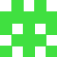
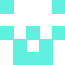

# Identicon generator for PHP

[](http://travis-ci.org/yzalis/Identicon)
[](https://codecov.io/github/yzalis/Identicon?branch=master)

**Identicon** is a library which generate an [identicon](http://en.wikipedia.org/wiki/Identicon) image based on a string.

Here is some examples of awesome results!

&nbsp;&nbsp;
&nbsp;&nbsp;
&nbsp;&nbsp;
&nbsp;&nbsp;


## Installation

The recommended way to install Identicon is through composer.

Just add the library to your project:

``` bash
composer require yzalis/identicon
```

## Usage

Images are generated in PNG format with transparent background.

The string can be an email, an IP address, a username, an ID or something else.

### Generate an identicon

Create a new ```Identicon``` object.

``` php
$identicon = new \Identicon\Identicon();
```

Then you can generate and display an identicon image

``` php
$identicon->displayImage('foo');
```

or generate and get the image data

``` php
$imageData = $identicon->getImageData('bar');
```

or generate and get the base 64 image uri ready for integrate into an HTML img tag.

``` php
$imageDataUri = $identicon->getImageDataUri('bar');
```
``` html
" alt="bar Identicon" />
```


### Change the size

By default the size will be 64 pixels. If you want to change the image size just add a secondary parameter. 512 x 512px in this example.

``` php
$identicon->displayImage('foo', 512);
```

### Color

The color is automatically generated according to the string hash but you can chose to specify a color by adding a third argument.

Color can be an hexadecimal with 6 characters

``` php
$identicon->displayImage('bar', 64, 'A87EDF');
```

or an array with red, green, blue value

``` php
$identicon->displayImage('foo', 64, array(200, 100, 150));
```

That's it!

### Generate an identicon on SVG format

The only thing you need to change it this one:
``` php
$identicon = new \Identicon\Identicon(new SvgGenerator());
$imageDataUri = $identicon->getImageDataUri('bar');
" alt="bar Identicon" />
```


## Unit Tests

To run unit tests, you'll need and a set of dependencies you can install using Composer:

```
php composer.phar install
```

Once installed, just launch the following command:

```
./vendor/bin/phpunit
```

Everything should be ok.


## Credits

* Benjamin Laugueux <benjamin@laugueux.org>
* [All contributors](https://github.com/yzalis/Identicon/graphs/contributors)

Inspired by Github [blog post](https://github.com/blog/1586-identicons) about Identicon.


## License

Identicon is released under the MIT License. See the bundled LICENSE file for details.
